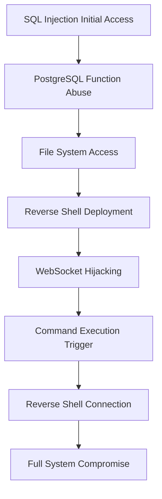

## Vulnerability Overview

CVE-2025-1094 is a critical vulnerability chain in PostgreSQL that enables attackers to escalate SQL injection attacks into full remote code execution through WebSocket connection hijacking.
This represents a significant security risk as it bridges database-layer vulnerabilities with application-layer attack vectors.

### Vulnerability Classification
- **Primary:** CWE-89: SQL Injection
- **Secondary:** CWE-749: Exposed Dangerous Method or Function
- **Tertiary:** CWE-918: Server-Side Request Forgery
- **Impact:** Full system compromise via privilege escalation

### Affected Components
- **Database:** PostgreSQL (misconfigured installations)
- **Attack Vector:** SQL injection → File read → WebSocket hijacking → RCE
- **Privilege Level:** Database user to SYSTEM/root access

# CVE-2025-1094 Attack Methodology

## Vulnerability Chain Overview

This exploit demonstrates a multi-stage attack chain that escalates from SQL injection to full remote code execution through PostgreSQL function abuse and WebSocket hijacking.

## Attack Flow

